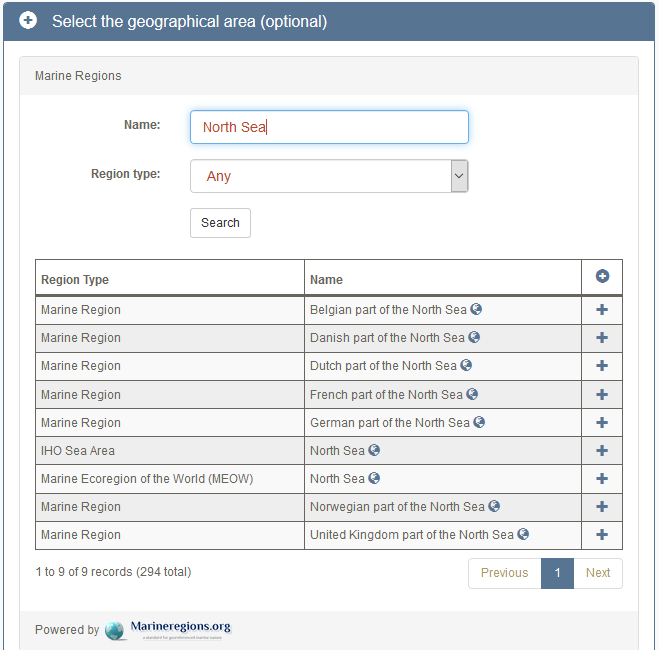
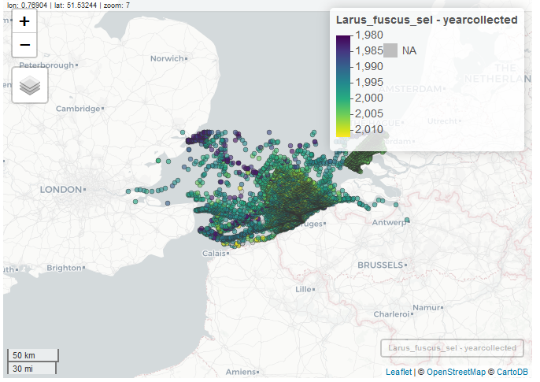
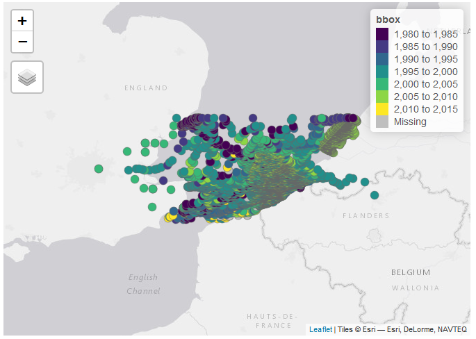

```{r setup, include=FALSE}
library(knitr)
library(kableExtra)
knitr::opts_chunk$set(
  eval = TRUE,
	echo = TRUE,
	fig.align = "center",
	message = FALSE,
	warning = FALSE
)
# set up python interpreter if not specified, it's the first on PATH
library(reticulate)
# use_python(PATH/TO/PYTHON)

# clean environment
rm(list=ls())
gc()
```

We will use the R packages listed below. They can be downloaded using the `install.packages()` command. In case you are running R on Windows, you may need to download [Rtools](https://cran.r-project.org/bin/windows/Rtools) to build the packages.

```{r, results='hide'}
#install.packages(c("dplyr","tidyr","wdpar","rgdal","rasterVis","downloader","directlabels","ggplot2","rgl","ncdf4","mapdata","maptools","geojsonio","lattice","reshape2","XML"))
# load dependencies
library(dplyr)
library(tidyr)
library(wdpar)
library(rgdal)
library(rasterVis)
library(downloader)
library(directlabels)
library(ggplot2)
library(rgl)
library(ncdf4)
library(mapdata)
library(maptools)
library(geojsonio)
library(lattice)
require(reshape2)
library(XML)
```

```{r, include=FALSE}
# for the rgl interactive plot
knit_hooks$set(webgl = hook_webgl)
```

During the first four exercises, we focus on the Pertuis Charentais Marine Protected Area (MPA) in France. The shapefile for this area can be downloaded from the [World Database on Protected Areas (WDPA)](https://www.protectedplanet.net/pertuis-charentais-site-of-community-importance-habitats-directive). For the sake of this tutorial, we will download it with the dedicated WDPA R-package `wdpar`.

```{r}
# get the MPA Shapefile from WDPA
wdpaid <- '555526224'
mpa <- as_Spatial(wdpa_fetch("France") %>% filter(WDPAID == wdpaid))
# alternatively load the doanloaded shapefile
# mpa <- shapefile("C:/EMODnet/R/OPENSEALAB/shapefile/WDPA_July2018_protected_area_555526224-shapefile-polygons.shp")

# get the spatial extent of the MPA
xmin <- extent(mpa)@xmin
ymin <- extent(mpa)@ymin
xmax <- extent(mpa)@xmax
ymax <- extent(mpa)@ymax
```

We make some maps to show the location of the MPA.

```{r}
# Localisation at global scale
map("worldHires",col="light grey",fill=T)
points(coordinates(mpa),cex=2,col="blue",pch="+")
title(paste("Region of interest ",
            "( W-Lon",round(xmin,2),
            "S-Lat",round(ymin,2),
            "E-Lon",round(xmax,2),
            "N-Lat",round(ymax,2),")"),cex=.5)

# Localisation at local scale
plot(mpa,xlim=c(xmin-1,xmax+1),ylim=c(ymin-1,ymax+1),axes=T,col="red")
map("worldHires",add=T,col="light grey",fill=T)
plot(mpa,add=T,col="blue")
title(paste("MPA",mpa$ORIG_NAME),cex=.5)
```


# EMODnet Bathymetry

## Access raster data through WCS

Using the EMODnet Bathymetry WCS, we will download the bathymetric data within the MPA.

```{r}
# Define a function to read in raster data from the EMODnet bathymetry WCS
getbathymetry<-function (name = "emodnet:mean", resolution = "0.2km", xmin = 15, xmax = 20.5, ymin = 30, ymax = 32.5){
  bbox <- paste(xmin, ymin, xmax, ymax, sep = ",")
                              
  con <- paste("https://ows.emodnet-bathymetry.eu/wcs?service=wcs&version=1.0.0&request=getcoverage&coverage=",name,"&crs=EPSG:4326&BBOX=", bbox, "&format=image/tiff&interpolation=nearest&resx=0.00208333&resy=0.00208333", sep = "")
  
  print(con)
  
  stop   
  nomfich <- paste(name, "img.tiff", sep = "_")
  nomfich <- tempfile(nomfich)
  download(con, nomfich, quiet = TRUE, mode = "wb")
  img <- raster(nomfich)
  img[img == 0] <- NA
  img[img < 0] <- 0
  names(img) <- paste(name)
  return(img)
}

# get the bathymetry data for the MPA
bathy_img <- getbathymetry(name = "emodnet:mean", resolution = "0.2km", xmin, xmax, ymin, ymax)
bathy<- as.data.frame(as(bathy_img, "SpatialPixelsDataFrame")) 
```

## Creating maps

We plot the bathymetry to see if everything is ok.

```{r}
map <- ggplot(aes(x=x, y=y, z=emodnet.mean), data = bathy) +
  geom_raster(data=bathy, aes(fill=emodnet.mean)) +
  scale_fill_gradient(low = "white", high = "darkblue",name="Depth (m)") +
  coord_quickmap(xlim=range(xmin,xmax),ylim=range(ymin,ymax)) +
  ggtitle("EMODnet bathymetry")+xlab("Longitude")+ylab("Latitude") +
  theme_bw()

map
```

We can overlie the bathymetry with the shape of the MPA

```{r}
map_mpa <- ggplot() +
  theme_bw() +
  theme(panel.grid.minor.y= element_blank(), panel.grid.minor.x = element_blank()) +
  geom_raster(data=bathy,aes(x=x,y=y,fill=emodnet.mean),alpha=.75) +
  scale_fill_gradient(low = "white", high = "darkblue",name="Depth (m)") +
  geom_polygon(data=mpa,aes(x=long,y=lat,group=group,fill="mpa"),colour="red",fill="blue",alpha=.1) +
  coord_quickmap(xlim=range(xmin,xmax),ylim=range(ymin,ymax)) +
  ggtitle("EMODnet bathymetry")+xlab("Longitude")+ylab("Latitude") 
   
  

map_mpa
```

We can also calculate and plot isobaths.

```{r}
map_iso	<- map + geom_contour(aes(colour = ..level..), color='gray30', na.rm=T, show.legend=T)
map_isobath = direct.label(map_iso, list("far.from.others.borders", "calc.boxes", "enlarge.box", 
      hjust = 1, vjust = 1, box.color = NA, fill = "transparent", "draw.rects"))
map_isobath
```

For mapping raster data, we can also use the `rasterVis` package to create level plots.

```{r, fig.width=7, fig.height=7}
pltbathy <- rasterVis::levelplot(bathy_img, margin = TRUE, contour=T, main="Bathymetry (m) - EMODnet",
                                 par.settings=rasterTheme(region=brewer.pal('Blues', n=9)))
pltbathy
```


## Creating 3D visualisations

Using the `persp()` function we can also make 3D visualisations.

```{r}
bathymetry.col<-function (n, alpha = 1){
  if ((n <- as.integer(n[1L])) > 0){
    j <- n%/%3
    k <- n%/%3
    i <- n - j - k
    c(if (i > 0) hsv(h = seq.int(from = 40/60, to = 40/60, length.out = i), alpha = alpha),
      if (j > 0) hsv(h = seq.int(from = 40/60, to = 40/60, length.out = j), alpha = alpha),
      if (k > 0) hsv(h = seq.int(from = 40/60, to = 40/60, length.out = k), alpha = alpha, s = seq.int(from = 1, to = 0.1, length.out = k),v = 1))
  }
  else character()
}

bathymetry3d <- -1*bathy_img
bathymetry3d[is.na(bathymetry3d)] <- 0
bathymetry3d[bathymetry3d > 0] <- 0

summary.elev <- summary(bathymetry3d)
setBaseElev <- function(x) {
  x[is.na(x)] <- as.numeric(summary.elev[1])
  return(x)
}
elev3D <- calc(bathymetry3d, setBaseElev)
zBathy <-round(as.matrix(elev3D),1)
y <- dim(zBathy)[1]
x <- dim(zBathy)[2]

nlat <- y
nlon <- x

nrz <- nrow(zBathy)
ncz <- ncol(zBathy)
zfacet <- (zBathy[-1, -1] + zBathy[-1, -ncz] + zBathy[-nrz, -1] + zBathy[-nrz, -ncz])/4
nbcol <- 254
color <- c("grey", bathymetry.col(nbcol))
facetcol <- cut(zfacet, nbcol+1)

steplat=(ymax-ymin)/nlat
steplon=(xmax-xmin)/nlon

latitude <- numeric(nlat)
for(i in 1:nlat){
  latitude[i]<-ymin+(i+0.5)*steplat
}

longitude <- numeric(nlon)
for(i in 1:nlon){
  longitude[i]<-xmin+(i+0.5)*steplon
}

img3d<- persp(latitude, longitude, z = zBathy, theta = 90, phi = 45, col = color[facetcol], scale = T, expand = 0.75, ltheta = 75, shade = 0.75, border = NA, box = T, ticktype = "detailed", xlab="", ylab="Longitude", zlab="Bathymetry (m)")
```

Using the `rgl` package, we can make it interactive.

```{r, eval = FALSE}
z <- -zBathy;
x <- (1:nrow(z))
y <- (1:ncol(z))
zlim <- range(z)
zlen <- zlim[2]-zlim[1]+1
#colorlut <- rev(terrain.colors(zlen,alpha=0))
colorlut<-rev(topo.colors(zlen,alpha=0))
#colorlut<-rev(topo.colors(220))
col<-colorlut[z-zlim[1]+1]
open3d()
rgl.surface(x,y,z,color=col)
```


## Exporting graphics 

The maps and 3D visualisation can be exported to images (e.g. PNG's).

```{r, results='hide'}
# determine dimensions of the images
width <- 960
height <- as.integer(width * (ymax-ymin) / (xmax-xmin))

#create unique id for the filenames
Sessionid = "OSLII_"

# output maps
png(file=paste(Sessionid,"_bathymetry2d_isobath.png",sep=""), width, height)
print(map_isobath)
dev.off()

png(file=paste(Sessionid,"_bathymetry2d_isobath_alt.png",sep=""), width, height)
print(pltbathy)
dev.off()

# output 3d visualisations

png(file=paste(Sessionid,"_bathymetry3d_90.png",sep=""), width, height)
img3d<- persp(latitude, longitude, z = zBathy, theta = 90, phi = 45, col = color[facetcol], scale = T, expand = 0.75, ltheta = 75, shade = 0.75, border = NA, box = T, ticktype = "detailed", xlab="", ylab="", zlab="Bathymetry (m)")
print(img3d)
dev.off()

png(file=paste(Sessionid,"_bathymetry3d_0.png",sep=""), width, height)
img3d<- persp(latitude, longitude, z = zBathy, theta = 0, phi = 45, col = color[facetcol], scale = T, expand = 0.75, ltheta = 75, shade = 0.75, border = NA, box = T, ticktype = "detailed", xlab="", ylab="", zlab="Bathymetry (m)")
print(img3d)
dev.off()

png(file=paste(Sessionid,"_bathymetry3d_180.png",sep=""), width, height)
img3d<- persp(latitude, longitude, z = zBathy, theta = 180, phi = 45, col = color[facetcol], scale = T, expand = 0.75, ltheta = 75, shade = 0.75, border = NA, box = T, ticktype = "detailed", xlab="", ylab="", zlab="Bathymetry (m)")
print(img3d)
dev.off()


png(file=paste(Sessionid,"_bathymetry3d_270.png",sep=""), width, height)
img3d<- persp(latitude, longitude, z = zBathy, theta = 270, phi = 45, col = color[facetcol], scale = T, expand = 0.75, ltheta = 75, shade = 0.75, border = NA, box = T, ticktype = "detailed", xlab="", ylab="", zlab="Bathymetry (m)")
print(img3d)
dev.off()
```

## Summarising raster data

From the raster data, we can derive statistics like the average depth and the standard deviations.

```{r}
values <- getValues(bathy_img$emodnet.mean)

# calcualte the average depth
m <- mean(values,na.rm=T)
m

# calculate the standard deviation
std_dev <- sd(values,na.rm=T)
std_dev
```


## Exporting data

### Exporting raster data

Using the `ncdf4` package, we can export the raster data to the netCDF format. The created netCDF file can then be used in other applications like [Panoply](https://www.giss.nasa.gov/tools/panoply/download).

```{r, results = 'hide'}
writeRaster(bathy_img, "EMODnet_bathymetry_555526224.nc", format="CDF", force_v4=TRUE, compression=7, overwrite=TRUE)
```

### Exporting vector data

The MPA shapefile can be exported in geoJSON format

```{r, results='hide'}
mpa_geojson <- geojson_json(mpa)
layer<-readOGR(dsn=mpa_geojson,layer = 'OGRGeoJSON')
geojson_write(layer, file = 'mpa.geojson')
```

## Accessing the original survey data

The EMODnet bathymetry data we have used throughout this exercise is a dataproduct that was calculated from a number of individual bathymetric surveys. In case we want to find the original survey data, EMODnet bathymetry provides a dataset with the outline of each of the individual surveys as well as their identification. In the script below, we access this source reference (vector) data using WFS (see [Exercise 2][Access vector data with WFS]) and investigate the different surveys in the MPA.

```{r, results='hide'}
# define a function to access the survey vector data using WFS
getDTMgeojson<-function(name="DTM_Surveys",xmin=-1,xmax=1,ymin=49,ymax=50){
  name<-as.character(name)
  bbox<-paste(xmin,ymin,xmax,ymax,sep=",")
  con<-paste0("https://ows.emodnet-bathymetry.eu/wfs?SERVICE=WFS&VERSION=1.0.0&request=GetFeature&typeName=",
  name,"&OUTPUTFORMAT=json&bbox=",bbox)
  ogrInfo(dsn=con,layer = 'OGRGeoJSON')
  layer<-readOGR(dsn=con,layer = 'OGRGeoJSON')
  print(con)
  return(layer)
}

# load the data
DTM_Surveys<-getDTMgeojson(name="emodnet:source_references",xmin,xmax,ymin,ymax)

#create a data frame to plot identifier on top of polygons
centroid <- aggregate(coordinates(DTM_Surveys) ~ identifier, data=DTM_Surveys, FUN=mean)
names(centroid) <- c("Name", "Longitude", "Latitude")

map <- ggplot() +
  theme_bw() +
  theme(panel.grid.minor.y= element_blank(), panel.grid.minor.x = element_blank()) +
  geom_raster(data=bathy,aes(x=x,y=y,fill=emodnet.mean),alpha=.75) +
  scale_fill_gradient(low = "white", high = "darkblue",name="Depth (m)") +
  # annotate("text", x=-1.5, y=46, label= "boat") +
  geom_polygon(data=DTM_Surveys,aes(x=long,y=lat,group=group,fill="DTM_Surveys"),colour="green",fill=NA) +
  # geom_text(check_overlap = TRUE) +
  geom_text(data=centroid, aes(label = Name, x = Longitude, y = Latitude), size=2, check_overlap = TRUE) +
  coord_quickmap(xlim=range(xmin,xmax),ylim=range(ymin,ymax))+
  ggtitle("DTM surveys")+xlab("Longitude")+ylab("Latitude")

map

```

Finally, we export the survey dataset to a geoJSON file.

```{r, results='hide'}
geojson_write(DTM_Surveys, file = 'bathy.geojson')
```


# EMODnet Human Activities

## Access vector data with WFS

The WFS of the EMODnet Human Activities portal allows collecting all kind of information for the MPA.

https://ows.emodnet-humanactivities.eu/wfs?service=WFS&request=GetCapabilities&version=1.1.0


### Point data

In this tutorial, we access point data from EMODnet Human Activities within the desired region of interest (the MPA) as a csv file.

To get/read the names of the columns of the layer (in this case "shellfish"):

* https://ows.emodnet-humanactivities.eu/wfs?SERVICE=WFS&VERSION=1.1.0&request=describeFeatureType&typeName=shellfish&OUTPUTFORMAT=application/json&bbox=-1.3,0.3,49.2,49.9
* https://ows.emodnet-humanactivities.eu/wfs?SERVICE=WFS&VERSION=1.1.0&request=describeFeatureType&typeName=shellfish&bbox=-1.3,0.3,49.2,49.9
* https://ows.emodnet-humanactivities.eu/wfs?service=wfs&version=2.0.0&request=DescribeFeatureType
* https://ows.emodnet-humanactivities.eu/wfs?service=wfs&version=2.0.0&request=GetPropertyValue&typeNames=shellfish&valueReference=the_geom&bbox=-1.3,0.3,49.2,49.9

Note: featureID and bbox are mutually exclusive:

* https://ows.emodnet-humanactivities.eu/wfs?SERVICE=WFS&VERSION=1.1.0&request=GetFeature&typeName=shellfish&OUTPUTFORMAT=csv&bbox=-1.3,0.3,49.2,49.9&featureID=the_geom


```{r}
# define a function to download the WFS data as a csv file 
gethumactpoint<-function(name="shellfish",xmin=-1000,xmax=1000,ymin=-1000,ymax=1000){
  name <- as.character(name)
  bbox <- paste(xmin,xmax,ymin,ymax,sep=",")
  con <- paste0("https://ows.emodnet-humanactivities.eu/wfs?SERVICE=WFS&VERSION=1.1.0&request=GetFeature&typeName=",name,"&OUTPUTFORMAT=csv&bbox=",bbox)
  utils::download.file(con,"dat.csv", quiet = TRUE, mode = "wb")
  pipo <- utils::read.csv("dat.csv")
  # if no data return empty dataframe
  if(ncol(pipo)<=1){
    return(data.frame())
  }
  # convert coordinates to numeric type
  else{
    xy <- strsplit(gsub("\\)","",gsub("POINT \\(","",pipo$the_geom)),split=" ")
    fun1 <- function(a){as.numeric(a[1])}
    fun2 <- function(a){as.numeric(a[2])}
    pipo$y <- sapply(xy,fun1)
    pipo$x <- sapply(xy,fun2)
    return(pipo)
  }
}

# function to format the dataframe
gethumactpointall<-function (xmin = -1.3, xmax = 0.3, ymin = 49.2, ymax = 49.9)
{
  layer="shellfish"
  #layer="windfarmspoly"
  #layer="windfarms"
  #layer="subunitcatches"
  #layer="subdivisioncatches"
  #layer="subareacatches"
  #layer="sigcables"
  #layer="portvessels"
  #layer="macroalgae"
  #layer="aggregates"
  
  # get csv file
  rez0 <- gethumactpoint(layer, ymin, xmin, ymax, xmax)
  # format dataframe
  if (nrow(rez0) > 0){
    ha <- data.frame(type = layer,
                     status = rez0$site_typology,
                     purpose = "",
                     info = rez0$species,
                     name = rez0$site_name,
                     country = rez0$country,
                     x = rez0$x,
                     y = rez0$y)
    rm(rez0)
  }
  return(ha)
}

# get the shellfish data 
ha<-gethumactpointall(xmin,xmax,ymin,ymax)
```

Investigate the downloaded data table and plot them on a map.

```{r ,echo=FALSE}
ha %>% knitr::kable(floating.environment="sidewaystable") %>% kable_styling(bootstrap_options = c("condensed","striped","hover"))
```

```{r}
map <- ggplot() +
  theme_bw() +
  theme(panel.grid.minor.y= element_blank(), panel.grid.minor.x = element_blank()) +
  geom_point(data=ha,aes(x=x,y=y),alpha=.5,color="red", size=2) +
  geom_polygon(data=mpa,aes(x=long,y=lat,group=group,fill="mpa"),colour="green",fill="blue",alpha=.1) +
  coord_quickmap(xlim=range(xmin,xmax),ylim=range(ymin,ymax)) +
  ggtitle("Human activities")+xlab("Longitude")+ylab("Latitude")

map
```

We can also combine several data layers in one table.

```{r}
# a function to format and combine data from different layers
gethumactpointall<-function (xmin = -1.3, xmax = 0.3, ymin = 49.2, ymax = 49.9){
  ha <- data.frame()
  rez0 <- gethumactpoint("finfish", ymin, xmin, ymax, xmax)
  if (nrow(rez0) > 0){
    ha1 <- data.frame(type = "finfish", status = rez0$status,
    purpose = rez0$purpose, info = rez0$species_harmonised,
    name = rez0$owner_name, country = rez0$country, x = rez0$x,
    y = rez0$y)
    ha <- rbind(ha, ha1)
    rm(rez0)
  }
  rez0 <- gethumactpoint("shellfish", ymin, xmin, ymax, xmax)
  if (nrow(rez0) > 0){
    ha1 <- data.frame(type = "shellfish", status = rez0$site_typology,
    purpose = "", info = rez0$species, name = rez0$site_name,
    country = rez0$country, x = rez0$x, y = rez0$y)
    ha <- rbind(ha, ha1)
    rm(rez0)
  }
  rez0 <- gethumactpoint("dredging", ymin, xmin, ymax, xmax)
  if (nrow(rez0) > 0){
    ha1 <- data.frame(type = "dredging", status = rez0$purpose,
    purpose = rez0$extraction_type, info = rez0$extraction_area,
    name = rez0$areaid, country = rez0$country, x = rez0$x,
    y = rez0$y)
    ha <- rbind(ha, ha1)
    rm(rez0)
  }
  rez0 <- gethumactpoint("hydrocarbons", ymin, xmin, ymax,
  xmax)
  if (nrow(rez0) > 0){
    ha1 <- data.frame(type = "hydrocarbons", status = rez0$status,
    purpose = rez0$purpose, info = rez0$company, name = rez0$name,
    country = rez0$country, x = rez0$x, y = rez0$y)
    ha <- rbind(ha, ha1)
    rm(rez0)
  }
  rez0 <- gethumactpoint("aggregates", ymin, xmin, ymax, xmax)
  if (nrow(rez0) > 0){
    ha1 <- data.frame(type = "aggregates", status = rez0$notes,
    purpose = rez0$purpose, info = rez0$extraction_type,
    name = rez0$extraction_area, country = rez0$country,
    x = rez0$x, y = rez0$y)
    ha <- rbind(ha, ha1)
    rm(rez0)
  }
  rez0 <- gethumactpoint("platforms", ymin, xmin, ymax, xmax)
  if (nrow(rez0) > 0){
    ha1 <- data.frame(type = "platforms", status = rez0$class,
    purpose = rez0$primary_production, info = rez0$category,
    name = rez0$name, country = rez0$country, x = rez0$x,
    y = rez0$y)
    ha <- rbind(ha, ha1)
    rm(rez0)
  }
  rez0 <- gethumactpoint("windfarms", ymin, xmin, ymax, xmax)
  if (nrow(rez0) > 0){
    ha1 <- data.frame(type = "windfarms", status = rez0$status,
    purpose = rez0$power_mw, info = "", name = rez0$name,
    country = rez0$country, x = rez0$x, y = rez0$y)
    ha <- rbind(ha, ha1)
    rm(rez0)
  }
  rez0 <- gethumactpoint("dredgespoil", ymin, xmin, ymax, xmax)
    if (nrow(rez0) > 0){
    ha1 <- data.frame(type = "dredgespoil", status = "",
    purpose = "", info = rez0$oscom_code, name = rez0$name,
    country = rez0$country, x = rez0$x, y = rez0$y)
    ha <- rbind(ha, ha1)
    rm(rez0)
  }
  rez0 <- gethumactpoint("munitions", ymin, xmin, ymax, xmax)
  if (nrow(rez0) > 0){
    ha1 <- data.frame(type = "munitions", status = "", purpose = "",
    info = rez0$munition_type, name = "", country = "",
    x = rez0$x, y = rez0$y)
    ha <- rbind(ha, ha1)
    rm(rez0)
  }

return(ha)
}

# get the data
ha <- gethumactpointall(xmin,xmax,ymin,ymax)
```

Plot the human activity data on map with the EMODnet bathymetry and the coastline data from the `mapdata` package. 

```{r}
map <- ggplot() +
  theme_bw() +
  theme(panel.grid.minor.y= element_blank(), panel.grid.minor.x = element_blank()) +
  geom_raster(data=bathy,aes(x=x,y=y,fill=emodnet.mean),alpha=.75) +
  scale_fill_gradient(low = "white", high = "darkblue",name="Depth (m)") +
  borders("worldHires",xlim=c(xmin,xmax),ylim=c(ymin,ymax),fill="light grey",colour="light grey") + 
  geom_point(data=ha,aes(x=x,y=y,shape=type,group=type),colour="red",alpha=1, size=4) +
  #geom_polygon(data=mpa,aes(x=long,y=lat,group=group,fill="mpa"),colour="green",fill="blue",alpha=.1)+
  coord_quickmap(xlim=range(xmin,xmax),ylim=range(ymin,ymax))+
  ggtitle("Human activities")+xlab("Longitude")+ylab("Latitude")

plot(map)
```

Finally, we export the point data to a csv file.

```{r}
write.csv(ha, file = "Humanactivities.csv", row.names = FALSE)
```


### Polygon data

We can also access polygon data as a geoJSON file with WFS. Here we download the natura2000 sites.

```{r}
# define a function to read the WFS data as a geoJSON file
gethumactgeojson<-function(name="natura2000areas",xmin=-1,xmax=1,ymin=49,ymax=50){
  name <- as.character(name)
  bbox <- paste(xmin,ymin,xmax,ymax,sep=",")
  con <- paste0("https://ows.emodnet-humanactivities.eu/wfs?SERVICE=WFS&VERSION=1.0.0&request=GetFeature&typeName=",name,"&OUTPUTFORMAT=application/json&bbox=",bbox)
  ogrInfo(dsn=con,layer = 'OGRGeoJSON')
  layer <- readOGR(dsn=con,layer = 'OGRGeoJSON')
  print(con)
  return(layer)
}

# get data
natura2000 <- gethumactgeojson(name="natura2000areas",xmin,xmax,ymin,ymax)
```

We can now overlay our map with the natura2000 sites.

```{r}
map <- ggplot()+
  theme_bw() +
  theme(panel.grid.minor.y= element_blank(), panel.grid.minor.x = element_blank()) +
  geom_raster(data=bathy,aes(x=x,y=y,fill=emodnet.mean),alpha=.75) +
  scale_fill_gradient(low = "white", high = "darkblue",name="Depth (m)") +
  geom_point(data=ha,aes(x=x,y=y,shape=type,group=type),colour="red", alpha=1, size=4) +
  geom_polygon(data=natura2000,aes(x=long,y=lat,group=group,fill="natura2000"),colour="green",fill="blue",alpha=.1) +
  coord_quickmap(xlim=range(xmin,xmax),ylim=range(ymin,ymax)) +
  ggtitle("Natura 2000 poly")+xlab("Longitude")+ylab("Latitude")

map
```

Finally, we export the polygon data to a geoJSON file.

```{r, results='hide'}
geojson_write(natura2000, file = 'natura2000.geojson')
```

## Access raster time series data with WCS

EMODnet human activities offers monthly datasets of vessel density for each type of vessel. With the script below we are downloading the vessel density data  for each month and each vessel type using the EMODnet human activities WCS.

```{r}
# define a function to access vessel density data from the EMODnet human activities WCS
getvesseldensityLite <- function(name = "emodnet:2017_01_st_All", resolution = "30 arcsec / 900m", xmin = 15, xmax = 20.5, ymin = 30, ymax = 32.5){
  bbox <- paste(xmin, ymin, xmax, ymax, sep = ",")                           
  con <- paste("https://ows.emodnet-humanactivities.eu/wcs?service=wcs&version=1.0.0&request=getcoverage&coverage=",name,"&crs=EPSG:4326&BBOX=", bbox, "&format=image/tiff&interpolation=nearest&resx=0.00833333&resy=0.00833333", sep = "") 
  nomfich <- paste(name, "img.tiff", sep = "_")
  nomfich <- tempfile(nomfich)
  download(con, nomfich, quiet = TRUE, mode = "wb")
  img <- raster(nomfich)
  img[img == 0] <- NA
  names(img) <- paste(name)
  return(img)
}

# define a function to make a rasterstack of monhtly vessel density data
createmonthlystack <- function(name = "emodnet:2017_",
                               vessel_type = "All",
                               resolution  = "30 arcsec",
                               xmin = 15, xmax = 20.5,
                               ymin = 30, ymax = 32.5){
  imgs <- stack()
  for (month in c('01','02','03','04','05','06','07','08','09','10','11','12')){
    img <- getvesseldensityLite(name = paste(name,month,"_st_",vessel_type, sep=""), resolution = resolution, xmin, xmax, ymin, ymax)
	  imgs <- stack(imgs,img)
  }
  return(imgs)
}

# create dataframe of vessel types
vesseltypes <- cbind.data.frame(type_id = c('All','00','01','02','03','04','05','06','07','08','09','10','11','12'),
                             type_name = c("ALL","OTHER","FISHING","SERVICE","DREDGING","SAILING","PLEASURE",
                                                 "HIGHSPEED","TUG","PASSENGER","CARGO","TANKER","MILITARY","UNKNOWN"),
                             stringsAsFactors=FALSE)

# loop over the different vessel types and create a stack for each one, combining them in a list
mpa_vessel_density_per_type = list()
for(i in 1:nrow(vesseltypes)){
  mpa_vessel_density_per_type[vesseltypes[i,"type_name"]] = createmonthlystack(vessel_type = vesseltypes[i,"type_id"],
                                                                               xmin = xmin, xmax=xmax,
                                                                               ymin = ymin, ymax=ymax)
}
```

We visualise these data by making monthly maps as well as a yearly average for a selected vessel type.

```{r, fig.width=8, fig.height=8}
# define a function to map the density maps, average yearly density and monthly climatology
mpaprocessplot<-function (imgs, mpa, name, unite, logscale) 
{
    if (dim(imgs)[3] < 12) {
        print("Series is too short (ie less than 12 months)")
    }
    else {
  		col.l <- colorRampPalette(c('white','cadetblue1','blue','cyan','green','yellow','orange','red','black'))
  		#col.l <- colorRampPalette(c('blue','cyan','green','yellow','orange','red','black'))
  		#imgs[imgs > 100] <- 100
  		ckey <- list(labels=list(cex=1.6, col='black'), height=1.0)
	
      imgsmean <- raster::mean(imgs, na.rm = T)

  	  
      
      # plot monthly data
      titre <- paste(name, " (", unite, ")", sep = "")
      pltall <- rasterVis::levelplot(imgs,
                                     zscaleLog = logscale, contour = F, 
                                     col.regions = col.l, colorkey=ckey,
                                     layout = c(4, NA),
                                     names = sub(".*(2017)_([0-9]{2})_.*","\\1.\\2",names(imgs)),
                                     main=list(label=titre, cex=1))
  
      titre <- paste(name, " (", unite, ") ",
                     sub(".*(2017)_([0-9]{2})_.*","\\1.\\2",names(imgs)[1]),
                     "-",
                     sub(".*(2017)_([0-9]{2})_.*","\\1.\\2",names(imgs)[dim(imgs)[3]]),
                     " average", sep = "")
      pltmean <- rasterVis::levelplot(imgsmean, margin = F,
                                      zscaleLog = logscale,contour = F,
                                      col.regions = col.l,  colorkey=ckey,
                                      main=list(label=titre, cex=1)) +
      contourplot(imgsmean, at = c(0,1,10,20,40,60) , labels = T)
  	
      titre <- paste(name, " (", unite, ") monthly boxplot", sep = "")
      pltbw <- rasterVis::bwplot(crop(imgs, extent(mpa)),logscale = T,
          scales = list(x = list(labels = names(imgs))), 
          main=list(label=titre, cex=1))
      
      return(list(pltall = pltall,
                  pltmean = pltmean,
                  pltbw = pltbw))
      }
}

# get a coastline shape
mappoly<-map("worldHires",fill=T,plot=FALSE,xlim=c(extent(mpa)@xmin-1,extent(mpa)@xmax+1),ylim=c(extent(mpa)@ymin-1,extent(mpa)@ymax+1))
IDs <- sapply(strsplit(mappoly$names, ":"), function(x) x[1])
coast<- map2SpatialPolygons(mappoly, IDs=IDs, proj4string=CRS("+proj=longlat +datum=WGS84"))

# make plots for the desired vessel types
types_to_plot= c("SAILING")
for(type in types_to_plot){
  plt_vessel <- mpaprocessplot(imgs = mpa_vessel_density_per_type[[type]],
                               mpa=mpa,
                               name=paste("Vessel density",type, sep=" - "),unite="hours/month",
                               logscale= !(type %in% c("HIGHSPEED","UNKNOWN"))) # too little data in these types to have a logscale
  #print map of the whole series
  img1 <- plt_vessel[[1]]+latticeExtra::layer(sp.polygons(coast,fill="grey",col="grey"))+latticeExtra::layer(sp.polygons(mpa))
  print(img1)
  #print map of the average 
  img2 <- plt_vessel[[2]]+latticeExtra::layer(sp.polygons(coast,fill="grey",col="grey"))+latticeExtra::layer(sp.polygons(mpa))
  print(img2)
  
  # save images as PNG
  png(file=paste(Sessionid,"_",wdpaid,"_VESSEL_monthly_composite-",type,".png",sep=""),width = 960, height = 960)
  print(img1)
  dev.off()

  png(file=paste(Sessionid,"_",wdpaid,"_VESSEL_average-",type,".png",sep=""),width = 960, height = 960)
  print(img2)
  dev.off()
}

```

```{r}
# get the area of the mpa

mpa$area_sqkm <- area(mpa)/1000000

# extract the average fishing density in the mpa for each vessel type and month
data_csv = data.frame(MONTH = c(01,02,03,04,05,06,07,08,09,10,11,12))
for(type in vesseltypes$type_name){
  monthly_means = c()
  for(month in 1:12){
    datinpoly <- raster::extract(mpa_vessel_density_per_type[[type]][[month:month]],mpa,df = TRUE, cellnumbers = TRUE)
    tabdat <- as.vector(as.matrix(datinpoly[, 3:ncol(datinpoly)]))
    mean_value <- sum(tabdat, na.rm = T)/mpa$area_sqkm
    monthly_means = c(monthly_means, mean_value)
  }
  data_csv[type]= monthly_means
}

# export the data
#write.csv(data_csv, file="mpa_monthly_average_density_per_type", row.names=FALSE, na="NaN")
```

Let us plot the time series of the averaged vessel density data.

```{r}
xyplot(ALL~MONTH, data=data_csv, type='l', auto.key=list(space='right'))
# Fishing > in Spring and Winter
xyplot(FISHING~MONTH, data=data_csv, type='l', auto.key=list(space='right'))
# Fishing is main vessel activity in the area
xyplot(FISHING+PASSENGER+SAILING+TANKER~MONTH, data=data_csv, type='l', auto.key=list(space='right'))
# Sailing covers the summer time when passenger transportation and tanker traffic are constant over the year.
xyplot(PASSENGER+SAILING+TANKER~MONTH, data=data_csv, type='l', auto.key=list(space='right'))

df <- melt(data_csv ,  id.vars = 'MONTH', variable.name = 'series')
# ggplot(df, aes(MONTH,value)) + geom_line() + facet_grid(series ~ .) + theme_bw()
ggplot(df, aes(MONTH,value)) + geom_line(aes(colour = series)) + theme_bw()
```


# EMODnet Physics

## EMODnet physics WFS

The [WFS](https://geoserver.emodnet-physics.eu/geoserver/emodnet/ows?service=WFS&request=GetCapabilities&version=1.0.0) of the EMODnet Physics portal offers the possibility to identify the existing in-situ measurements for the region of interest (bbox).


```{r}
# define a function to download point data as csv from the EMODnet physics WFS
getEMODnetPhysicsplatform<-function(name="EP_PLATFORMS_SLEV",xmin=-1000,xmax=1000,ymin=-1000,ymax=1000){
  name<-as.character(name)
  bbox<-paste(xmin,xmax,ymin,ymax,sep=",")
  con<-paste0("https://geoserver.emodnet-physics.eu/geoserver/emodnet/wfs?SERVICE=WFS&VERSION=1.1.0&request=GetFeature&typeName=",name,"&OUTPUTFORMAT=csv&bbox=",bbox)
  utils::download.file(con,"dat.csv", quiet = TRUE, mode = "wb")
  pipo<-utils::read.csv("dat.csv")
  if(ncol(pipo)<=1){
    return(data.frame())
  }
  else{
    xy<-strsplit(gsub("\\)","",gsub("POINT \\(","",pipo$position)),split=" ")
    fun1<-function(a){as.numeric(a[1])}
    fun2<-function(a){as.numeric(a[2])}
    pipo$y<-sapply(xy,fun1)
    pipo$x<-sapply(xy,fun2)
    print(con)
    return(pipo)
  }

}

# define a function to combine different data layers in a dataframe
getEMODnetPhysicsplatformall<-function (xmin = -1.3, xmax = 0.3, ymin = 49.2, ymax = 49.9){
  physics <- data.frame()
  
  rez0 <- getEMODnetPhysicsplatform("EP_PLATFORMS_SLEV", ymin, xmin, ymax, xmax)
  if (nrow(rez0) > 0){
    physics1 <- data.frame(type = "EP_PLATFORMS_SLEV", status = rez0$ProjectsDescr,
    purpose = rez0$ParametersGroupDescr, info = rez0$DataOwner, name = rez0$PlatformID, PltLink = rez0$PlatformInfoLink,
    country = rez0$Country, x = rez0$x, y = rez0$y)
    physics <- rbind(physics, physics1)
    rm(rez0)
  }
  
  rez0 <- getEMODnetPhysicsplatform("EP_PLATFORMS_WIND", ymin, xmin, ymax, xmax)
  if (nrow(rez0) > 0){
    physics1 <- data.frame(type = "EP_PLATFORMS_WIND", status = rez0$ProjectsDescr,
    purpose = rez0$ParametersGroupDescr, info = rez0$DataOwner, name = rez0$PlatformID, PltLink = rez0$PlatformInfoLink,
    country = rez0$Country, x = rez0$x, y = rez0$y)
    physics <- rbind(physics, physics1)
    rm(rez0)
  }
  
  rez0 <- getEMODnetPhysicsplatform("EP_PLATFORMS_WAVE", ymin, xmin, ymax, xmax)
  if (nrow(rez0) > 0){
    physics1 <- data.frame(type = "EP_PLATFORMS_WAVE", status = rez0$ProjectsDescr,
    purpose = rez0$ParametersGroupDescr, info = rez0$DataOwner, name = rez0$PlatformID, PltLink = rez0$PlatformInfoLink,
    country = rez0$Country, x = rez0$x, y = rez0$y)
    physics <- rbind(physics, physics1)
    rm(rez0)
  }
  
  rez0 <- getEMODnetPhysicsplatform("EP_PLATFORMS_TEMP", ymin, xmin, ymax, xmax)
  if (nrow(rez0) > 0){
    physics1 <- data.frame(type = "EP_PLATFORMS_TEMP", status = rez0$ProjectsDescr,
    purpose = rez0$ParametersGroupDescr, info = rez0$DataOwner, name = rez0$PlatformID, PltLink = rez0$PlatformInfoLink,
    country = rez0$Country, x = rez0$x, y = rez0$y)
    physics <- rbind(physics, physics1)
    rm(rez0)
  }
  
  rez0 <- getEMODnetPhysicsplatform("EP_PLATFORMS_HCXX", ymin, xmin, ymax, xmax)
  if (nrow(rez0) > 0){
    physics1 <- data.frame(type = "EP_PLATFORMS_HCXX", status = rez0$ProjectsDescr,
    purpose = rez0$ParametersGroupDescr, info = rez0$DataOwner, name = rez0$PlatformID, PltLink = rez0$PlatformInfoLink,
    country = rez0$Country, x = rez0$x, y = rez0$y)
    physics <- rbind(physics, physics1)
    rm(rez0)
  }
  
  rez0 <- getEMODnetPhysicsplatform("EP_PLATFORMS_MO", ymin, xmin, ymax, xmax)
  if (nrow(rez0) > 0){
    physics1 <- data.frame(type = "EP_PLATFORMS_MO", status = rez0$ProjectsDescr,
    purpose = rez0$ParametersGroupDescr, info = rez0$DataOwner, name = rez0$PlatformID, PltLink = rez0$PlatformInfoLink,
    country = rez0$Country, x = rez0$x, y = rez0$y)
    physics <- rbind(physics, physics1)
    rm(rez0)
  }
  
  rez0 <- getEMODnetPhysicsplatform("EP_PLATFORMS_HFR", ymin, xmin, ymax, xmax)
  if (nrow(rez0) > 0){
    physics1 <- data.frame(type = "EP_PLATFORMS_HFR", status = rez0$ProjectsDescr,
    purpose = rez0$ParametersGroupDescr, info = rez0$DataOwner, name = rez0$PlatformID, PltLink = rez0$PlatformInfoLink,
    country = rez0$Country, x = rez0$x, y = rez0$y)
    physics <- rbind(physics, physics1)
    rm(rez0)
  }
  
  rez0 <- getEMODnetPhysicsplatform("EP_PLATFORMS_FB", ymin, xmin, ymax, xmax)
  if (nrow(rez0) > 0){
    physics1 <- data.frame(type = "EP_PLATFORMS_FB", status = rez0$ProjectsDescr,
    purpose = rez0$ParametersGroupDescr, info = rez0$DataOwner, name = rez0$PlatformID, PltLink = rez0$PlatformInfoLink,
    country = rez0$Country, x = rez0$x, y = rez0$y)
    physics <- rbind(physics, physics1)
    rm(rez0)
  }
  
  rez0 <- getEMODnetPhysicsplatform("EP_PLATFORMS_GL", ymin, xmin, ymax, xmax)
  if (nrow(rez0) > 0){
    physics1 <- data.frame(type = "EP_PLATFORMS_GL", status = rez0$ProjectsDescr,
    purpose = rez0$ParametersGroupDescr, info = rez0$DataOwner, name = rez0$PlatformID, PltLink = rez0$PlatformInfoLink,
    country = rez0$Country, x = rez0$x, y = rez0$y)
    physics <- rbind(physics, physics1)
    rm(rez0)
  }

return(physics)
}

# get the data in the MPA
physics<-getEMODnetPhysicsplatformall(xmin,xmax,ymin,ymax)
```

We now plot the EMODnet physics data on a map and export the data to a CSV file.

```{r}
map<-ggplot() +
  theme_bw() +
  theme(panel.grid.minor.y= element_blank(), panel.grid.minor.x = element_blank()) +
  geom_raster(data=bathy,aes(x=x,y=y,fill=emodnet.mean),alpha=.75) +
  scale_fill_gradient(low = "white", high = "darkblue",name="Depth (m)") +
  geom_point(data= physics,aes(x=x,y=y,shape=type,group=type),colour="green", alpha=1, size=4) +
  #geom_polygon(data=natura2000,aes(x=long,y=lat,group=group,fill="natura2000"),colour="red",fill="blue",alpha=.1) +
  coord_quickmap(xlim=range(xmin,xmax),ylim=range(ymin,ymax)) +
  ggtitle("EMODnet Physics Platforms")+xlab("Longitude")+ylab("Latitude")
plot(map)


write.csv(physics, file = "EMODnetPhysics.csv")
```

## Alternative EMODnet physics web services

* UniqueURL (netCDF, metadata, )

  + https://www.emodnet-physics.eu/map/platinfo/piradar.aspx?platformid=10273
  + https://www.emodnet-physics.eu/map/platinfo/pidashboard.aspx?platformid=10273


* Service description @

  + https://www.emodnetphysics.eu/map/spi.aspx


* API (REST, SOAP) web services [latest 60 days of data]

  + www.emodnet-physics.eu/map/Service/WSEmodnet2.aspx
  + www.emodnet-physics.eu/map/service/WSEmodnet2.asmx
 
 
* OGC (WMS, WFS, …)

  + https://geoserver.emodnet-physics.eu/geoserver/emodnet/ows


* Opendap/THREDDS [HFR data, Ice, climatologies] (netCDF)

  + https://thredds.emodnet-physics.eu/thredds/catalog.html
  + Unidata's THREDDS Data Server (TDS) is a web server that provides metadata and data access for scientific datasets, using OPeNDAP, OGC WMS and WCS, HTTP, and other remote data access protocols.


* ERDDAP [latest 60 days of data]

  + https://erddap.emodnet-physics.eu/erddap/index.html
  + ERDDAP is a data server that gives you a simple, consistent way to download subsets of scientific datasets in common file formats and make graphs and maps. This particular ERDDAP installation has oceanographic data (for example, data from satellites and buoys).


* Widgets:

  + https://www.emodnet-physics.eu/Map/Charts/PlotDataTimeSeries.aspx?paramcode=TEMP&platid=8427&timerange=7

<iframe src ="https://www.emodnet-physics.eu/Map/Charts/PlotDataTimeSeries.aspx?paramcode=TEMP&platid=8427&timerange=7" height=500px width=800px />
  
# EMODnet seabed habitats and EMODnet geology

## Access map layers with WMS

In this exercise, we will gather information on the seafloor using the WMS of EMODnet seabed habitats and EMODnet geology:

* https://ows.emodnet-seabedhabitats.eu/emodnet_view/ows?service=WMS&request=GetCapabilities&version=1.1.0

* https://drive.emodnet-geology.eu/geoserver/tno/wms?service=WMS&request=GetCapabilities&version=1.1.0

### EUNIS classification (EMODnet seabed habitats)

In the script below, we download the EUNIS classification map image.

```{r}
# determine width and height of the WMS image to download
width <- 960
height <- as.integer(width * (extent(mpa)@ymax-extent(mpa)@ymin) / (extent(mpa)@xmax-extent(mpa)@xmin)) 

bbox <- paste(extent(mpa)@xmin, extent(mpa)@ymin, extent(mpa)@xmax, extent(mpa)@ymax, sep = ",")

# download the image
con <- paste0("https://ows.emodnet-seabedhabitats.eu/emodnet_view/ows?layers=eusm2019_group&bbox=", bbox,
"&service=WMS&format=image/png&interpolation=nearest&srs=EPSG:4326&request=GetMap&height=",height,"&width=",width,"")
download(con, "img.png", quiet = TRUE, mode = "wb")
img <- brick("img.png")

# set extent and determine map projection
img@extent@xmin <- xmin
img@extent@ymin <- ymin
img@extent@xmax <- xmax
img@extent@ymax <- ymax
proj4string(img)<-CRS("+proj=longlat +datum=WGS84")
```

Now we can add the downloaded and georeferenced image to our MPA map.

```{r}
# define fucntion to plot the image
rggbplot <- function(inRGBRst,npix=NA,scale = 'lin'){
 
  rgblinstretch <- function(rgbDf){
    maxList <- apply(rgbDf,2,max)
    minList <- apply(rgbDf,2,min)
    temp<-rgbDf
    for(i in c(1:3)){
      temp[,i] <- (temp[,i]-minList[i])/(maxList[i]-minList[i])
    }
    return(temp)
  }
 
  rgbeqstretch<-function(rgbDf){
 
    temp<-rgbDf
    for(i in c(1:3)){
      unique <- na.omit(temp[,i])
      if (length(unique>0)){
        ecdf<-ecdf(unique)
        temp[,i] <- apply(temp[,i,drop=FALSE],2,FUN=function(x) ecdf(x))
      }
    }
    return(temp)
  }
 

      npix <- ncell(inRGBRst)

  x <- sampleRegular(inRGBRst, size=npix, asRaster = TRUE)
  dat <- as.data.frame(x, xy=TRUE)
  colnames(dat)[3:5]<-c('r','g','b')
 
  if(scale=='lin'){
    dat[,3:5]<- rgblinstretch(dat[,3:5])
  } else if(scale=='stretch'){
    dat[,3:5]<- rgbeqstretch(dat[,3:5])
  }
  p <- ggplot()+ geom_tile(data=dat, aes(x=x, y=y, fill=rgb(r,g,b))) + scale_fill_identity()
 
}

# draw the map
map <- rggbplot(img) +
  theme_bw() +
  coord_quickmap(xlim=range(xmin,xmax),ylim=range(ymin,ymax)) +
  geom_polygon(data=natura2000,aes(x=long,y=lat,group=group,fill="natura2000"),colour="red",fill="blue",alpha=.1) +
  ggtitle("EMODnet Seabed Habitats - EUNIS classification")+xlab("Longitude")+ylab("Latitude")
map
```

### Biological zone (EMODnet seabed habitats)

In the script below, we download the biological zone map image.

```{r}
# determine width and height of the WMS image to download
width <- 960
height <- as.integer(width * (extent(mpa)@ymax-extent(mpa)@ymin) / (extent(mpa)@xmax-extent(mpa)@xmin)) 

bbox <- paste(extent(mpa)@xmin, extent(mpa)@ymin, extent(mpa)@xmax, extent(mpa)@ymax, sep = ",")

# download the image
con <- paste0("https://ows.emodnet-seabedhabitats.eu/emodnet_view/ows?layers=eusm2019_bio_group&bbox=", bbox,
"&service=WMS&format=image/png&interpolation=nearest&srs=EPSG:4326&request=GetMap&height=",height,"&width=",width,"")
download(con, "img.png", quiet = TRUE, mode = "wb")
img <- brick("img.png")

# set extent and determine map projection
img@extent@xmin <- xmin
img@extent@ymin <- ymin
img@extent@xmax <- xmax
img@extent@ymax <- ymax
proj4string(img)<-CRS("+proj=longlat +datum=WGS84")
```

Now we can add the downloaded and georeferenced image to our MPA map.

```{r}
# draw the map
map <- rggbplot(img) +
  theme_bw() +
  coord_quickmap(xlim=range(xmin,xmax),ylim=range(ymin,ymax)) +
  geom_polygon(data=natura2000,aes(x=long,y=lat,group=group,fill="natura2000"),colour="red",fill="blue",alpha=.1) +
  ggtitle("EMODnet Seabed Habitats - Biological zone")+xlab("Longitude")+ylab("Latitude")
map
```

### Seabed substrate (EMODnet geology)

In the script below, we download the seabed substrate map image.

```{r}
# determine width and height of the WMS image to download
width <- 960
height <- as.integer(width * (extent(mpa)@ymax-extent(mpa)@ymin) / (extent(mpa)@xmax-extent(mpa)@xmin)) 

bbox <- paste(extent(mpa)@xmin, extent(mpa)@ymin, extent(mpa)@xmax, extent(mpa)@ymax, sep = ",")

# download the image
con <- paste0("https://drive.emodnet-geology.eu/geoserver/gtk/wms?layers=seabed_substrate_1m&bbox=", bbox,
"&service=WMS&format=image/png&interpolation=nearest&srs=EPSG:4326&request=GetMap&height=",height,"&width=",width,"")
download(con, "img.png", quiet = TRUE, mode = "wb")
img <- brick("img.png")

# set extent and determine map projection
img@extent@xmin <- xmin
img@extent@ymin <- ymin
img@extent@xmax <- xmax
img@extent@ymax <- ymax
proj4string(img)<-CRS("+proj=longlat +datum=WGS84")
```

Now we can add the downloaded and georeferenced image to our MPA map.

```{r}
# draw the map
map <- rggbplot(img) +
  theme_bw() +
  coord_quickmap(xlim=range(xmin,xmax),ylim=range(ymin,ymax)) +
  geom_polygon(data=natura2000,aes(x=long,y=lat,group=group,fill="natura2000"),colour="red",fill="blue",alpha=.1) +
  ggtitle("EMODnet Geology - Seabed substrate")+xlab("Longitude")+ylab("Latitude")
map
```

## Access point data with WFS

In this exercise we access the coastal migration point data from the EMODnet geology WFS within the desired region of interest (the MPA) as a csv file.

```{r}
# define a function to download the WFS data as a csv file 
getEMODnetCoastalMigration<-function(name="tno:coastal_migration_satellite_0_40k",xmin=-1000,xmax=1000,ymin=-1000,ymax=1000){
  name<-as.character(name)
  bbox<-paste(xmin,xmax,ymin,ymax,sep=",")
  con<-paste0("https://drive.emodnet-geology.eu/geoserver/tno/wfs?SERVICE=WFS&VERSION=1.1.0&request=GetFeature&typeName=",
  name,"&OUTPUTFORMAT=csv&bbox=",bbox)
  utils::download.file(con,"dat.csv", quiet = TRUE, mode = "wb")
  pipo<-utils::read.csv("dat.csv")
  if(ncol(pipo)<=1){
    return(data.frame())
  }
  else{
    xy<-strsplit(gsub("\\)","",gsub("POINT \\(","",pipo$geom)),split=" ")
    fun1<-function(a){as.numeric(a[1])}
    fun2<-function(a){as.numeric(a[2])}
    pipo$y<-sapply(xy,fun1)
    pipo$x<-sapply(xy,fun2)
    print(con)
    return(pipo)
  }
}

# function to format the dataframe
getEMODnetCoastalMigrationformall<-function (xmin = -1.3, xmax = 0.3, ymin = 49.2, ymax = 49.9){
  geology <- data.frame()
  rez0 <- getEMODnetCoastalMigration("tno:coastal_migration_satellite_0_40k", ymin, xmin, ymax, xmax)
  if (nrow(rez0) > 0){
    geology1 <- data.frame(type = "tno:coastal_migration_satellite_0_40k", Migration = rez0$changerate, name = rez0$id,
    x = rez0$x, y = rez0$y)
    geology <- rbind(geology, geology1)
    rm(rez0)
  }
  return(geology)
}

# get the data
geology<-getEMODnetCoastalMigrationformall(xmin,xmax,ymin,ymax)
```

We now plot the coastal migration data on a map and export the data to a CSV file.

```{r}
# make a map
map<-ggplot() +
  theme_bw() +
  theme(panel.grid.minor.y= element_blank(), panel.grid.minor.x = element_blank()) +
  geom_raster(data=bathy,aes(x=x,y=y,fill=emodnet.mean),alpha=.75) +
  scale_fill_gradient(low = "white", high = "darkblue",name="Depth (m)") +
  geom_point(data= geology,aes(x=x,y=y,shape=type,group=type,color=Migration), alpha=1, size=2) +
  #scale_shape_manual(name = "Coastal Migration", values = c(4)) + 
  scale_colour_distiller(palette = "Spectral", limits = c(-50, 50)) +
  coord_quickmap(xlim=range(xmin,xmax),ylim=range(ymin,ymax)) +
  ggtitle("EMODnet Geology Coastal migration")+xlab("Longitude")+ylab("Latitude")

plot(map)

# export the data to csv
write.csv(geology, file = "EMODnetGeology-CoastalMigration.csv")
```


# EMODnet Biology 

We will show three section on how to work with EMODnet Biology data:

* download data from the webportal and then load and visualize these data in R
* download a selection of the data based on specific WFS queries
* access the EMODnet Biology data products based on WFS queries

For more information, please check the EMODnet Biology website
<http://www.emodnet-biology.eu/emodnet-biology-api>

## Download in EMODnet Biology webportal  

Now we will download some EMODnet Biology species observations with the Download Toolbox:

* Go to <http://www.emodnet-biology.eu/>
* Navigate to Data & data product access -> Data Download -> the [Data Download Toolbox](http://www.emodnet-biology.eu/toolbox)
* Here you can select and download the data in two steps:
    + Select a Datasource, Geographical Area or time period (all optional), Click 'Next'
    + Select a Species trait, Taxonomic search, a measurement type (abundance/biomass) or Data Precision (all optional), Click 'Next'
* Now you have an overview of all your data, which you can download, view on a webmap, ...
* If you selected a large area, it can take a while before your map/download starts

Now, if we want for example the data of Lesser Black-backed Gull ([*Larus fuscus*](http://www.marinespecies.org/aphia.php?p=taxdetails&id=137142)) in the North Sea,
then we have to provide the **Geographical Area** and the **Taxonomic Search** in the toolbox to refine our results.

The Geographical area can be set by searching on 'North Sea'. This will give you a number of results from the [MarineRegions](http://marineregions.org) database.
<center></center>  

<br>
  
You then can select for example the IHO Sea Area 'North Sea'.
You can also draw a rectangle on the small map to indicate your extent. 

In the taxonomic search, fill in *Lesser Black-backed Gull*.
You see that two taxa appear, select the first one with AphiaID 137142.

Now you can download the data, view the data on the map or get the webservice url.
If you click 'download', you have to fill in your country and purpose and then click 'prepare download'.
For the 15000+ records in my selection, it took less than a minute to prepare the download (4 MB).
Now I can load and visualize the data in R:

```{r message=FALSE, warning=FALSE, error=FALSE, fig.align='center'}
library(data.table)
library(sf)

# load downloaded file
fname <- 'Larus_fuscus_NZ.csv'
Larus_fuscus_NZ <- fread(fname,
            header = TRUE,
            sep = ',')

# convert to sf object
Larus_fuscus_NZ_sf <- st_as_sf(Larus_fuscus_NZ,
                              coords = c("longitude", "latitude"), 
                              crs = 4326)

# base plot
plot(st_geometry(Larus_fuscus_NZ_sf), axes = TRUE)

# Plot data in ggplot, color by month
if (utils::packageVersion("ggplot2") > "2.2.1"){
  ggplot() +
    geom_sf(data=Larus_fuscus_NZ_sf,
          aes(colour=monthcollected))
}
```


```{r eval= FALSE, message=FALSE, warning=FALSE, error=FALSE, fig.align='center', results='hide'}
# interactive map, color by year
# for faster performance in this tutorial, we select only a part:
# long: 0-5?
# lat: 50-52?
selectbox <- st_polygon(list(rbind(c(0,50), c(0,52), c(5,52), c(5,50), c(0,50))))
selectbox <- st_sfc(selectbox, crs = 4326)

Larus_fuscus_sel <- Larus_fuscus_NZ_sf %>% 
                        filter(st_intersects(., selectbox, sparse = FALSE))


# you can create interactive maps with the mapview package:
# more info: https://github.com/r-spatial/mapview
library(mapview)
mapview(Larus_fuscus_sel,
        zcol = 'yearcollected',
        cex = 3, lwd = 0.5,
        legend = TRUE)

```


***

<br>

## Download by EMODnet Biology webservices

We can also download the occurrence data directly in R with the WFS api:
<http://www.emodnet-biology.eu/emodnet-biology-api>

If we want to retrieve the same dataset, we need the species aphiaid and a geographical area.

1. Each species has it's own identification number, aphiaid (from the [aphia database](http://www.marinespecies.org/about.php#what_is_aphia)), so we first retrieve this number with the worrms package.

```{r message=FALSE, warning=FALSE, error=FALSE, fig.align='center', results='hide'}
# install.packages('worrms')
# more info:
# https://docs.ropensci.org/worrms/ and http://www.marinespecies.org/
library(worrms)

# search taxa by common name:
wm_records_common(name = 'Lesser Black-backed Gull')

# or by taxonomic name (by default with fuzzy matching):
wm_records_name(name = 'Larus fuscus')

# without fuzzy matching returns only one result: 137142
aphiaid <- wm_records_name(name = 'Larus fuscus', fuzzy = FALSE)


```


2. We only want data in the North Sea. We can do this by searching for a MarineRegion. The [MarineRegions](http://marineregions.org) database contains a lot of marine place names, and we can query the database by using the mregions package.

```{r message=FALSE, warning=FALSE, error=FALSE, fig.align='center', results='hide'}
# library(dplyr)
# install.packages('mregions')
# more info:
# https://docs.ropensci.org/mregions/ and http://www.marineregions.org/
library(mregions)


# search by name for an area in the MarineRegions database
# by default, the search uses a 'LIKE' function
mr_geo_code(URLencode('North Sea'))

# without 'LIKE' search
mr_geo_code(URLencode('North Sea'), like = FALSE)

# we filter on placeType = 'IHO Sea Area'
mrgid <- mr_geo_code(URLencode('North Sea'), like = FALSE) %>%
         filter(placeType == 'IHO Sea Area')

```

Now that we have the our AphiaID (species identification) and MRGID (geographic area), we can build our WFS request and download the data:
```{r message=FALSE, warning=FALSE, error=FALSE, fig.align='center', results='hide'}
# library(data.table)
# library(sf)

# list the parts of the wfs url
base_url   <- 'http://geo.vliz.be/geoserver/ows'
service    <- '?request=GetFeature&service=WFS&version=1.1.0'
typeName   <- '&typeName=Dataportal:eurobis'
resultType <- '&resultType=results'
viewParams <- '&viewParams=context:0100;'
paramAphia <- paste0('aphiaid:', aphiaid$AphiaID)
paramGeo   <- paste0('where:(up.geoobjectsids && ARRAY[', mrgid$MRGID, '])')
outFormat   <- '&outputFormat=csv'

# combine to wfs url, providing the AphiaID and the MRGID
csv_url <- paste0(base_url, service, typeName, resultType,
                  viewParams,
                  URLencode(paste(paramAphia, paramGeo, sep=';'), reserved = TRUE),
                  outFormat)

# get the csv directly by the webservice url
Larus_fuscus_NZ_web <- fread(csv_url,
            header = TRUE,
            sep = ',')


# but you can also directly get the spatial data:
wfs_url <- paste0(base_url, service, typeName,
                  viewParams,
                  URLencode(paste(paramAphia, paramGeo, sep=';'), reserved = TRUE),
                  '&outputFormat=application/json')

Larus_fuscus_NZ_web_sf <- st_read(wfs_url)
```

Make a static map with the tmap package:
```{r message=FALSE, warning=FALSE, error=FALSE, fig.align='center'}

# interactive map
# another R package to visualize spatial data is 'tmap':
# more info: https://github.com/mtennekes/tmap
# install.packages('tmap')
library(tmap)

# set static map mode
tmap_mode("plot")

map_NZ <- tm_shape(Larus_fuscus_NZ_web_sf) +
  tm_dots(size= 0.1,
          col = 'yearcollected',
          palette = 'viridis',
          title = 'North Sea')

map_NZ
```
We can also make a WFS request by combining the aphiaID and a bounding box:
```{r message=FALSE, warning=FALSE, error=FALSE, fig.align='center', results='hide'}
# set bbox (other wfs parameters, see above)
bbox       <- paste0('&bbox=', URLencode('-4.45,51,12.01,61.02,EPSG:4326',reserved=TRUE))

# combine parts into wfs url
wfs_bbox <- paste0(base_url, service, typeName,
                  viewParams, paramAphia, bbox,
                  '&outputFormat=application/json')

# this results in slightly more points (22897 vs 15873)
Larus_fuscus_bbox_web_sf <- st_read(wfs_bbox)


map_bbox <- tm_shape(Larus_fuscus_bbox_web_sf) +
  tm_dots(size= 0.1,
          col = 'yearcollected',
          palette = 'viridis',
          title = 'bbox')

tmap_arrange(map_NZ, map_bbox)
```


```{r eval=FALSE, message=FALSE, warning=FALSE, error=FALSE, fig.align='center', results='hold'}
# for performance of this online tutorial, we subset to a smaller area.

# for faster performance in this tutorial, we select only a part:
# long: 0-5?
# lat: 50-52?
selectbox <- st_polygon(list(rbind(c(0,50), c(0,52), c(5,52), c(5,50), c(0,50))))
selectbox <- st_sfc(selectbox, crs = 4326)

Larus_fuscus_bbox_sel <- Larus_fuscus_bbox_web_sf %>% 
                        filter(st_intersects(., selectbox, sparse = FALSE))

tmap_mode("view")

map_bbox_sel <- tm_shape(Larus_fuscus_bbox_sel) +
  tm_dots(size= 0.1,
          col = 'yearcollected',
          palette = 'viridis',
          title = 'bbox')

map_bbox_sel
```


<!--                                     -->
<!--- THIS PART IS FROM THE ORIGINAL DOC -->
<!--                                     -->


## Access EMODnet Biology products

Using the EMODnet biology WFS services we can access the EMODnet Biology products, for example the zooplankton abundances for different grid cells within the North Sea (bbox), averaged over a 10-year period.

To see the other products, see <http://www.emodnet-biology.eu/about-atlas> or <http://www.emodnet-biology.eu/geoviewer>.
All 'relative abundance' layers are based on EMODnet Biology products and can be accessed through WFS requests.
Please contact the EMODnet Biology coaches for more details.

```{r}
# library(sf)
# library(dplyr)

# set the request parameters
typename='Emodnetbio:OOPS_products_vliz'
paramspec = 'Acartia spp'
trendstart = 2004
trendend = 2013 # this is a 10-year average
seasoncode = 1
bbox <- paste(-4.45,51,12.01,61.02, sep = ",")


# build the WFS URL
url<-"http://geo.vliz.be/geoserver/Emodnetbio/ows?service=WFS&version=1.0.0&request=GetFeature"
full_url<-paste(url,
                "&typeName=",typename,
                "&viewParams=;startYearCollection:", trendstart,
                ";scientificName:", URLencode(paramspec),
                ";season:",seasoncode,
                "&BBOX=",bbox,
                "&outputFormat=application/json",
                sep="")

# read directly as sf object with {sf}
Acartia_spp <- st_read(full_url)

# mean
Acartia_spp %>% st_drop_geometry %>% summarise(mean = mean(measurementValue))
```

Now we can plot the values on the map
```{r}
#add axes, remove polygon border
plot(Acartia_spp["measurementValue"], axes = TRUE, border = NA)

```


### time series data with WFS

Using WFS, we can also access the zooplankton abundance time series:

```{r}
#library(sf)
# determine parameters
typename = 'Emodnetbio:OOPS_summaries'
paramspec = 'Acartia spp' #species
trendstart = 1958 #startDate
trendend = 2013 #endDate

# construct WFS url on the layer OOPS_summaries
# Note that this WFS doesn't work with the viewParams specification (as previous example),
# buth with a CQL filter
url <- 'http://geo.vliz.be/geoserver/Emodnetbio/ows?service=WFS&version=1.0.0&request=GetFeature'
full_url<-paste(url,
                "&typeName=",typename,
                URLencode(paste0("&CQL_FILTER",
                      "=startYearCollection-endYearCollection=0", # only 1-year averages
                      " AND scientificName='", paramspec,"'")),
                "&outputFormat=application/json",
                sep="")

# get the data
Acartia_ts <- st_read(full_url)
```

We now analyse the time series seasonality and trends using the `stl()` loess seasonal decomposition function.

```{r}
seldata<-Acartia_ts[with(Acartia_ts, order(Acartia_ts$startYearCollection,Acartia_ts$season)),]
# convert to a time series object
tscf<-ts(data=seldata$avg_ab, start=trendstart, end=trendend, frequency=4)
# decompose the time series
fitstl<-stl(tscf,s.window="periodic",t.window=15)
plot(fitstl)
```


# Search for data using EMODnet Catalogue Service

Using the EMODnet Catalogue Service for the Web (CSW), we can query and search collections of metadata for data, services and information objects related to the EMODnet Marine Data. In the example below, we use the `XML` package to send a request to the CSW endpoint, parse the XML response and store it in a dataframe.

```{r}
# CSW request
url_getcapa="http://www.emodnet.eu/geonetwork/emodnet/eng/csw?REQUEST=GetRecords&SERVICE=CSW&VERSION=2.0.2&ELEMENTSETNAME=summary&OUTPUTSCHEMA=http://www.opengis.net/cat/csw/2.0.2&CONSTRAINTLANGUAGE=FILTER&CONSTRAINT_LANGUAGE_VERSION=1.1.0&RESULTTYPE=results&TYPENAMES=csw:Record&CONSTRAINT=%3Cogc:Filter%20xmlns:ogc=%22http://www.opengis.net/ogc%22%3E%3Cogc:PropertyIsEqualTo%3E%3Cogc:PropertyName%3Edc:type%3C/ogc:PropertyName%3E%3Cogc:Literal%3Edataset%3C/ogc:Literal%3E%3C/ogc:PropertyIsEqualTo%3E%3C/ogc:Filter%3E&maxRecords=1000"

# get and parse response to a dataframe
response = xmlParse(url_getcapa)
response = xmlToList(response)
results = data.frame()
for(record in response$SearchResults[names(response$SearchResults) == "SummaryRecord"]){
  # cast to datafame, negating empty fields
  df = as.data.frame(Filter(Negate(is.null),record))
  # combine multiple subjects into 1 column
  if(sum(grepl("subject",names(df))) > 1){
    df = unite(df,"subject",contains("subject"), sep = ", ", remove = TRUE)
  }
  # combine multiple formats into 1 column
  if(sum(grepl("format",names(df))) > 1){
    df = unite(df,"format",contains("format"), sep = ", ", remove = TRUE) 
  }
  results = bind_rows(results,df)
}
```


Now that we have all the records stored in a dataframe, we can perform detailed queries.

```{r}
# look for Records with keyword 'Habitat'
results %>%
  filter(grepl("Habitat",results$subject)) %>%
  # limit printing length of abstract
  mutate(abstract = paste(substring(abstract,0,80),"...")) %>%
  knitr::kable(floating.environment="sidewaystable") %>% kable_styling(bootstrap_options = c("condensed","striped","hover"))
```

```{r}
# look for Records with keyword 'substrate'
results %>%
  filter(grepl("substrate",results$subject)) %>%
  mutate(abstract = paste(substring(abstract,0,80),"...")) %>%  # limit printing length of abstract
  knitr::kable(floating.environment="sidewaystable") %>% kable_styling(bootstrap_options = c("condensed","striped","hover"))
```

