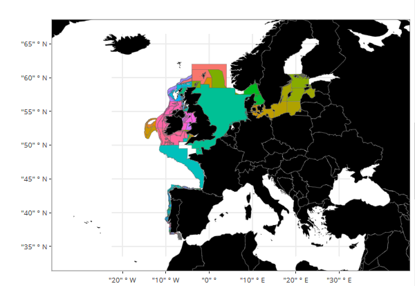

```{r setup, include=FALSE}
library(knitr)
library(kableExtra)
knitr::opts_chunk$set(
  eval = TRUE,
	echo = TRUE,
	fig.align = "center",
	message = FALSE,
	warning = FALSE
)
# set up python interpreter if not specified, it's the first on PATH
library(reticulate)
# use_python(PATH/TO/PYTHON)

# clean environment
rm(list=ls())
gc()
```

We will use the R packages listed below. They can be downloaded using the `install.packages()` command. In case you are running R on Windows, you may need to download [Rtools](https://cran.r-project.org/bin/windows/Rtools) to build the packages. We also install the `esri2sf` package from [github](https://github.com/yonghah/esri2sf) to scrape the ArcGIS REST API.

```{r, results='hide'}
# install.packages(c("icesSAG","sf","ggplot2","plotly","devtools"))
library(devtools)
install_github("yonghah/esri2sf")
# load dependencies
library(icesSAG)
library(sf)
library(esri2sf)
library(ggplot2)
library(plotly)
```

ICES offers web services to download tabular data as map services to access geospatial data. 

# Access ICES web services

In this excercise we will use the [`icesSAG` package](https://github.com/ices-tools-prod/icesSAG) to access the [web services](http://sg.ices.dk/webservices.aspx) of the ICES [Stock Assessment Graphs](http://ices.dk/marine-data/assessment-tools/Pages/stock-assessment-graphs.aspx) database. In the script we get the summary data for all sandeel stocks published in 2018.
```{r}
summary_data <- getSAG(stock="Sandeel", year=2018)
head(summary_data)
```
We now plot the recruitment evolution of the different sandeel stocks.

```{r}
ggplot(summary_data[complete.cases(summary_data[c("Year", "recruitment")]),], 
       aes(x=Year, y=recruitment, group = fishstock, colour = fishstock)) +
    geom_line()
```

# Access ICES map services

Along with the data services, ICES hosts services for spatial datasets. All of ICES reference layers such as the ICES Areas, ICES Statistical rectangles, ICES Ecoregions can be accessed through thier map server located at http://gis.ices.dk/gis/rest/services. This map server can be accessed either through the [ArcGIS REST API](https://developers.arcgis.com/documentation/core-concepts/rest-api/) or through [OGC webservices](https://www.opengeospatial.org/standards/owc).

In this tutorial we access vector data through the ArcGIS REST API using the `esri2sf` package which saves the data in an [`sf` object](https://github.com/r-spatial/sf). For the sake of this tutorial we will download the Datras Survey Areas available at http://gis.ices.dk/gis/rest/services/ICES_Datasets/DATRAS_GIS_full/MapServer/0, selecting only the AreaName and Description fields.

```{r}
datras = esri2sf("http://gis.ices.dk/gis/rest/services/ICES_Datasets/DATRAS_GIS_full/MapServer/0",outFields = c("AreaName","Description"))
head(datras)
```

We now make an interactive map of the areas and description (note: on the website this is static)

```{r eval=FALSE}
# get european countries
datras_map = ggplot()+
            geom_sf(data = datras, aes(fill = AreaName, name=Description), size = 0.1)+
            borders(fill = "black", size = 0.1)+
            coord_sf(xlim=c(-20,30),ylim=c(35,65))+
            theme_bw()+
            theme(legend.position = "none",axis.title = element_blank())
ggplotly(datras_map,)
```

